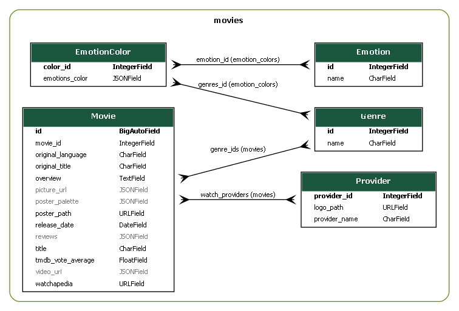
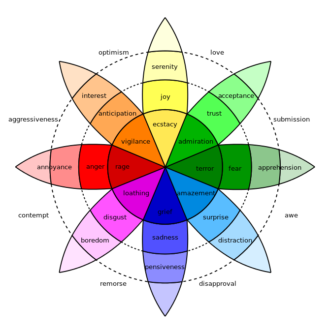
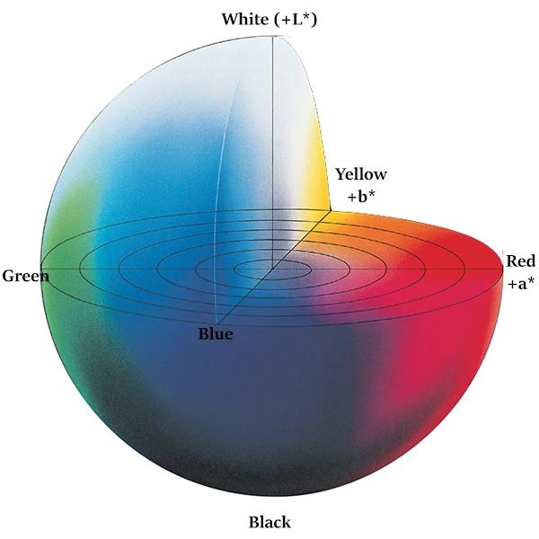
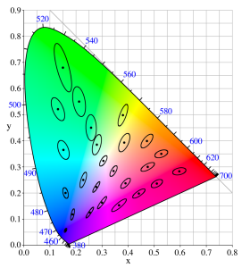

최종 관통 프론젝트

12기 1학기 최종 관통 프로젝트

개발 배경
- 왜 만들게 되었는지 깃랩 참고해서 쓰면 될 것 같음.

주제

- 딥러닝 기반 안면인식 데이터를 활용한 감정, 색 추출 및 데이터, 감정, 색 기반 영화 추천 서비스

- `배포 할 거면 링크 넣기`
- 카메라를 이용한 감정 분석

  - 웹소켓을 활용, 백엔드로 사용자 표정사진 전달.
  - 자체 제작한 딥러닝 모델을 사용. 사용자 감정 추출.
  - 감정값을 전 / 후로 나누어 통계적으로 분석. 변화값으로 현재 감정을 추론.

- 감정기반 색상 추출

  - 색채심리학 기반 감정별 색상 매칭
  - 현재 감정 ( 주감정, 부감정 \* 2) 기준으로 사용자에게 어울리는 색상 추출

- 감정, 색 기반 영화 추천
  - 현재 감정 기반 장르 매칭
  - 매칭된 장르 내에서 추출한 색상과 가장 어울리는 포스터를 가진 영화를 선별.

개요

- 수상 내역

  - 시발.

- 프로젝트 진행 기간

  - 사전준비 기간은 뺄까? ( 빼는 게 좋긴 함 )
  - 24.11.18(월) - 24.11.26(화) / 9일간 진행.

  - 배포 할거면 하는 기간 추가

- 프로젝트 팀

  - 유지웅 : 프론트(정), 백엔드(부), 알고리즘
  - 김주찬 : 백엔드(정), 프론트(부), 알고리즘

- 기술 스택

  - DB

    - SQLite

  - BACK

    - Django
    - Channel ( Web socket )
    - Daphne

  - FRONT

    - Vue 3
    - axios
    - Web socket
    - pinia
    - router

  - API

    - 자체제작 API ( TMDB + 왓챠피디아 크롤링 )

  - Data

    - 감정사진 50만장
    - 색채심리학 자료

  - Version Control

    - gitlab
    - github

  - CoOperation Tool

    - Discord
    - MatterMost

  - 배포 ( 한다면 )

- ERD

  

기술
- 웹 소켓 (web socket)

- 데이터 수집

  - TMDB API

    - discover에서 popularity 순으로 정렬.
    - 한국에서 볼 수 있고, 국내 스트리밍 사업자에서 제공하는 영화로 한정.
    - tmdb상 평점 6점 이상, 투표수 200표 이상인 영화로 필터링.
    - 1페이지 당 20개의 영화가 있으며, 총 250페이지 가져왔고, 그 중 100페이지만 사용. -> 그 이후는 유의미하지 않다고 판단.
      2000개의 데이터를 넣었고, 중복 제외하고 1693개가 DB로 생성됨
    - 이후 TMDB로 가져온 포스터로 색상 파레트 추출 실행 후 저장

  - Selenium

    - TMDB로 가져온 데이터에서 영화 제목과 상영 연도를 이용해 Watchapeida에서 검색 후 데이터 추출
    - 리뷰 데이터와 스틸컷, 예고편 그리고 해당 영화 상세 페이지 주소를 추출 후 저장.
    - TMDB가 제공한 영화 제목과 Watchapedia에 등록된 제목이 불일치 하거나 상영 연도 정보가 불일치 하는 경우 따로 데이터 저장하고 Watchapedia상의 올바른 정보로 수정하여 다시 추출
    - 크롤링 중 에러 발생으로 몇 시간동안 수집한 데이터가 사라지는 불상사 발생 -> 각 페이지별로 정보 저장 후 추후에 모든 페이지를 합치는 방식으로 변경.

- 감정분석 ( 딥러닝 + 알고리즘 )

  - AI 허브에서 가져온 사전 학습된 모델을 이용.
  - 선정 이유 : 모델을 학습시키기 위한 시간과 데이터 수집 시간의 부족.

  - 프론트와 백 사이에 web socket을 열어서 실시간으로 사용자 사진을 백으로 보냄.
  - 백에서는 현재 사용자 상태 / 감정 유도 이후 상태 로 데이터를 나누어 감정데이터의 값을 `알고리즘`을 통해 처리함
  - 알고리즘 : 감정데이터를 딕셔너리 형태로 모으고, 로버스트 통계를 활용하여 정규화, 표준편차를 통해 감정 변화값을 추출
  - 로버스트 통계를 사용한 이유 : 사용자의 감정이 정규분포를 이루지 않을 가능성이 높고, 측정한 감정값 중에서 이상값들을 배제하기 위해서 사용.
  - 정규화 한 이유 : 모든 값의 합이 100이어서 절대적 변화량을 측정하기 힘듦으로 전체 크기를 1로 통일
  - 표준편차 : 중간값에서 가장 크게 요동친 값을 주된 감정으로 분석. 이를 위해서 이상치 탐지가 가능한 IQR 표준편차를 이용.
  - t-test 사용 : 1번째 측정한 집단과 2번째 측정한 집단의 분산이 동질한지 검정하기 위해 사용.<br>t-value와 p-value로 유의성을 판단하며, p-value가 .05보다 클 경우 두 집단의 분산이 동질하다고 판단. -> 의미있는 감정 변화라고 판단<br>이를 바탕으로 감정 점수와 유의성이 높은 순으로 주감정과 부감정을 분류

- 색채심리학 ( 관련 논문 )

  - 현재 심리에 따라서 색상값을 연결하기 위해 학술자료를 활용.
  - [색채 심리학](https://www.thedigitalmkt.com/color-psychology/)
  - 
  - 학술 자료에서 감정에 대한 기준을 다양하게 나누어 우리가 사전에 지정하였던 7개의 감정으로 정확히 매치하기 힘듦.
  - 유사한 감정과 연계하여 감정-색상 데이터 연결

- 색상파레트 추출 ( 라이브러리 )

  - 관련 라이브러리 사용
  - [Pylette](https://github.com/qTipTip/Pylette)
  - 포스터에서 주로 사용된 색상, 색상별 지배도 추출

- 색상유사도 ( 알고리즘 )

  - CIE(국제조명위원회)에서 개발한 색상 차이를 측정하는 표준 방법을 활용함.
  - 
  - CIELAB 기준 유사도를 판별
  - [CIELAB 설명](https://ko.wikipedia.org/wiki/CIELAB_%EC%83%89_%EA%B3%B5%EA%B0%84#:~:text=Lab%20%EC%83%89%20%EA%B3%B5%EA%B0%84%EC%9D%80%20%EC%9D%B8%EA%B0%84,%ED%95%98%EB%8A%94%20%EC%98%81%EC%97%AD%EB%A7%8C%EC%9D%84%20%EB%B3%B4%EC%97%AC%EC%A3%BC%EB%8A%94%20%EA%B7%B8%EB%A6%BC)
  - CIE76으로 사용( 유클리드 거리를 기준으로 유사도 판별 )
  - 이후 정확도를 높이기 위해 CIE94( 가중치 )에서 CIE dE2000으로 변경

  - 
  - [Color Space](https://en.wikipedia.org/wiki/Color_space)
  - [CIE dE 2000](https://techkonusa.com/demystifying-the-cie-%CE%B4e-2000-formula/)
  - 색상의 유사도를 파악하기 위해 비선형적으로 공간을 휘어 실제로 보았을 때 더욱 유사한 색감을 뽑아낼 수 있도록 함.

- 영화추천 ( 알고리즘 )

  - 감정 기준으로 장르 선별, 포스터 색상 기준 색상으로 유사도, 지배도를 고려하여 색감이 유사한 영화를 선별.

- 적용

감정 분석 방식

# 실시간 감정 분석 시스템

이 프로젝트는 실시간 영상에서 얼굴을 감지하고 감정을 분석하는 시스템입니다. WebSocket을 통해 클라이언트와 서버 간 실시간 통신을 구현하여 연속적인 감정 분석을 수행합니다.

## 주요 기능

### 1. 모델 및 분류기 로딩

```python
def load_model():
    global model, face_classifier
    face_classifier = cv2.CascadeClassifier(pth.join(getcwd(), assets,'face_classifier.xml'))
    if torch.cuda.is_available():
        device = 'cuda'
    else:
        device = 'cpu'
    model_state = torch.load(pth.join(getcwd(), assets, 'model.pth'), map_location=torch.device(device), weights_only=True)
    model = getModel('emotionnet', True)
    model.load_state_dict(model_state['model'])
```

이 함수는 얼굴 감지를 위한 Haar Cascade 분류기와 감정 분석을 위한 딥러닝 모델을 로드합니다. GPU 사용 가능 여부를 확인하고 적절한 장치에 모델을 로드합니다.

### 2. WebSocket 연결 및 메시지 처리

```python
class VideoStreamConsumer(AsyncWebsocketConsumer):
    async def connect(self):
        await self.accept()

    async def receive(self, text_data):
        data = json.loads(text_data)
        message_type = data.get('type')

        if message_type == 'start_analysis':
            # 분석 시작
        elif message_type == 'frame':
            # 프레임 처리
        elif message_type == 'second_phase':
            # 두 번째 단계 시작
        elif message_type == 'stop_analysis':
            # 분석 종료 및 결과 전송
```

이 클래스는 WebSocket 연결을 관리하고 클라이언트로부터 받은 메시지를 처리합니다. 분석 시작, 프레임 처리, 두 번째 단계 시작, 분석 종료 등 다양한 메시지 유형을 처리합니다.

### 3. 실시간 얼굴 감지 및 감정 분석

```python
async def main(self, frame_data):
    # 이미지 디코딩
    frame = cv2.imdecode(nparr, cv2.IMREAD_COLOR)

    # 얼굴 감지
    faces = face_classifier.detectMultiScale(gray, 1.3, 5)

    for (x, y, w, h) in faces:
        # 얼굴 영역 추출 및 전처리
        roi_gray = cv2.resize(roi_gray, (48, 48), interpolation=cv2.INTER_AREA)

        # 감정 분석
        tensor = self.emotion_model(roi)
        probs = F.softmax(tensor, dim=1).detach().numpy()[0] * 100
```

이 함수는 클라이언트로부터 받은 프레임에서 얼굴을 감지하고 감정을 분석합니다. 얼굴 영역을 추출하여 전처리한 후, 미리 로드된 감정 분석 모델을 사용하여 각 감정의 확률을 계산합니다.

### 4. 데이터 정규화 및 통계 분석

```python
async def process_first_results(self, first_phase_data):
    # 데이터 필터링 및 정규화
    df = pd.DataFrame(valid_data)
    df_filtered = remove_outliers_iqr(df)
    normalized_data = scaler.fit_transform(df_filtered)

    # 평균 및 표준편차 계산
    normalized_means = df_normalized.mean()
    normalized_std = df_normalized.std()
```

이 함수는 첫 번째 분석 단계의 데이터를 처리합니다. 이상치를 제거하고 RobustScaler를 사용하여 데이터를 정규화한 후, 각 감정에 대한 평균과 표준편차를 계산합니다.

### 5. 최종 결과 분석

```python
async def process_final_results(self, first_analysis_result, second_analysis_result):
    # 감정 변화량 계산
    emotion_changes = {}
    for emotion in class_labels:
        change = round(second_value - first_value, 2)
        emotion_changes[emotion] = change

    # 통계적 유의성 검정
    t_statistic, p_value = stats.ttest_ind(
        first_analysis_result['raw_data'][emotion],
        second_analysis_result['raw_data'][emotion]
    )

    # 주감정 및 부감정 선정
    sorted_emotions = sorted(emotion_scores.items(), key=lambda x: x[1], reverse=True)
    result['primary_emotion'] = {sorted_emotions[0][0]: sorted_emotions[0][1]}
```

이 함수는 첫 번째와 두 번째 분석 단계의 결과를 비교하여 최종 분석 결과를 생성합니다. 각 감정의 변화량을 계산하고, 통계적 유의성을 검정하며, 주감정과 부감정을 선정합니다.

## 작동 원리

1. 클라이언트가 WebSocket 연결을 통해 서버에 연결합니다.
2. 클라이언트가 영상 프레임을 서버로 전송합니다.
3. 서버는 각 프레임에서 얼굴을 감지하고 감정을 분석합니다.
4. 분석 결과는 두 단계로 나누어 처리됩니다:
   - 첫 번째 단계: 기준 감정 상태를 설정합니다.
   - 두 번째 단계: 감정 변화를 측정합니다.
5. 각 단계의 데이터는 정규화되고 통계적으로 분석됩니다.
6. 최종 결과에서는 감정 변화량, 통계적 유의성, 주감정 및 부감정을 판단합니다.

이 시스템은 실시간으로 사용자의 감정 변화를 추적하고 분석할 수 있어, 다양한 응용 분야에서 활용될 수 있습니다.

Citations:
[1] https://ppl-ai-file-upload.s3.amazonaws.com/web/direct-files/39359080/122719dc-f260-4a46-8d6b-35257193f266/paste.txt

색상 처리 방식

RGB에서 LAB 색공간으로 변환

```py
def rgb_to_lab(rgb):
    rgb_normalized = np.array(rgb) / 255.0
    rgb_normalized = rgb_normalized.reshape(1, 1, 3)
    lab = skcolor.rgb2lab(rgb_normalized)
    return lab[0, 0]
```

RGB 값을 0-1 사이로 정규화
LAB 색공간으로 변환하여 인간의 시각적 인식과 유사한 방식으로 색상 표현

CIEDE2000 알고리즘 사용

```py
def delta_e_2000(lab1, lab2, kL=1, kC=1, kH=1):
    # L: 명도(Lightness)
    # a: 빨강-초록 축
    # b: 노랑-파랑 축
```

두 색상 간의 차이를 계산하는 가장 정확한 방식 중 하나
명도, 채도, 색상의 차이를 각각 고려하여 종합적인 색상 차이 계산

영화 추천 프로세스
감정 색상 세트 찾기

```py
color_set = EmotionColor.objects.filter(
    emotion_id__in=current_emotions
).first()
```

입력된 감정 ID들에 맞는 색상 세트 검색
가장 많은 감정을 포함하는 세트부터 검색

장르 기반 필터링

```py
matching_movies = Movie.objects.filter(
    genre_ids__name__in=[genre.name for genre in color_set.genres_id.all()]
).distinct()
```

색상 세트와 연관된 장르의 영화들만 선택

색상 유사도 계산

```py
similarities = []
for emotion_color in color_set.emotions_color:
    for poster_color in movie.poster_palette:
        similarity = calculate_color_similarity(emotion_color, poster_color[:3])
        similarities.append((similarity, poster_color[3]))
```

감정 색상과 영화 포스터의 색상 팔레트를 비교
각 색상의 지배도(dominance)를 가중치로 사용

최종 점수 계산

```py
avg_similarity = np.mean([s[0] for s in similarities])
weighted_dominance = np.average(
    [s[1] for s in similarities],
    weights=[1/s[0] if s[0] != 0 else 1 for s in similarities]
)
```

색상 유사도의 평균과 지배도를 결합하여 최종 점수 계산
유사도가 높을수록 가중치가 높아지는 방식 사용

영화 정렬 및 선택

```py
sorted_movies = [movie for movie, _ in sorted(movie_scores, key=lambda x: x[1])][:51]
sorted_movies.reverse()
```

계산된 점수를 기준으로 영화 정렬
상위 51개 영화 선택 후 역순 정렬

기타 / 배운 점 / 깨달은 점 등 모든 기록

- 느낀 점

- 아쉬웠던 점

- 깃허브 협업 세팅

```

```
