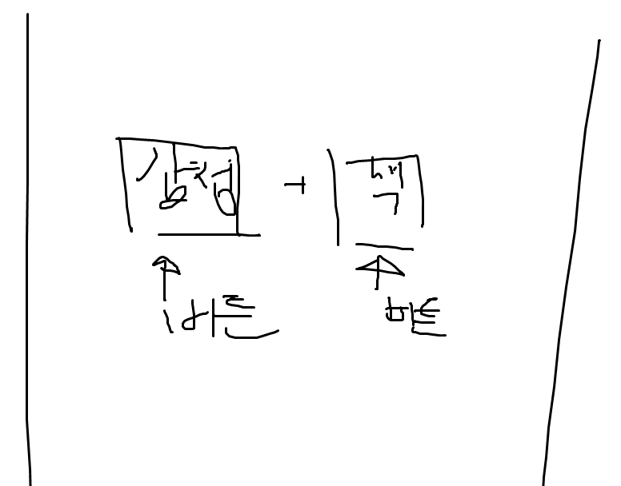
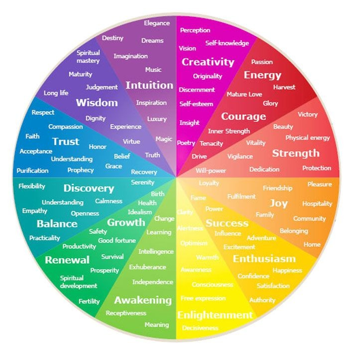

1. 11월 01일

   - 회의

   ```md
   유지웅[부울경_1반]
   오전 9:21
   친구가

   감독 추천해주는 서비스 어떠냐고 제안하던데

   이거 괜찮긴한데 누가 하긴 했겠지?

   유지웅[부울경_1반]
   오전 9:22
   내가 이런 영화 좋아한다 -> 이런 작품은 이 감독 -> 이 감독이 찍은 영화

   간단하게 이런 느낌?
   ```

2. 11월 06일

   ```md
   감정이 선택의 만족도를 올려줄 수 있다는 증거는 여러 연구에서 확인되었습니다. 다음은 관련 증거를 제공하는 연구 결과들입니다:
   문화와 감정의 부합: 연구에 따르면, 문화와 감정이 부합할 때 고객의 만족도가 높아지는 것으로 나타났습니다. 반대로, 문화와 감정이 부합하지 않을 경우 만족도가 낮아질 수 있습니다. 이는 감정이 고객의 만족도에 중요한 역할을 한다는 것을 보여줍니다1.
   고객 감정의 영향: 긍정적인 감정은 고객의 참여도와 충성도를 높이는 데 기여할 수 있습니다. 예를 들어, 기쁨이나 설렘과 같은 감정은 고객이 더 만족스러운 경험을 하도록 돕습니다. 반면, 부정적인 감정은 고객 이탈로 이어질 수 있어, 기업은 긍정적인 감정을 유도하는 전략을 통해 고객 만족도를 높일 수 있습니다2.
   소비자 감정과 만족: 소비자 행동 연구에서는 긍정적인 감정이 소비자 만족에 정적인 영향을 미친다는 점을 밝혔습니다. 이는 소비자가 제품이나 서비스를 사용할 때 느끼는 긍정적인 감정이 전반적인 만족도를 높일 수 있음을 시사합니다3.
   이러한 연구들은 감정이 선택의 만족도를 높이는 데 중요한 요소임을 뒷받침하고 있으며, 기업과 마케터가 이를 활용하여 고객 경험을 개선할 수 있음을 보여줍니다.
   [https://www.perplexity.ai/search/peurojegteu-myeongseseoga-mweo-72Zlh3fdQh.wtkz4pHjiyw#5]
   ```

   ```md
   1. 아이템 선정

   - 프로젝트 주제 : 사용자 `감정` 기반 영화 추천 서비스
   - 이걸 왜 만들게 되었는가? :

   1. 영화를 볼거야. 근데 뭘 볼지 모르겠어. OR
   2. 고르는데 한 세월이야. 빨리 정하고 봐야되는데? OR
   3. 당사자의 현재 감정이 영화를 고르는데 중요한 지표가 된다 (자료1) 이렇게 고른 영화는 만족도를 올려준다. -> 근거가 필요하다.

   - 자료는 추후 검색 요망.

   1. 개요

   - 프로젝트 명칭 : `감정의 색`

   - 개발 인원 및 기간 : 2명 11/18~11/26

   - 주요 기능 :

   1. 사용자 감정 분석 -> 동영상, 사진V -> 카메라 응시 -> 사진 10장정도 촬영 -> 감정은 7가지 -> 7가지 항목(중립 하나) -> 감정별로 영화 추천 리스트 작성 -> 감정의 퍼센테이지 만큼 영화의 비중이 바뀐다. API존재?
   2. 별점, 좋아요 기능(개인의 취향, 통계적인 것->개인정보를 확실하게 받아서 통계적으로 활용할 수 있도록.),
   3. CRUD(문의 게시판, 댓글),
   4. 검색?
   5. 색감 -> 몇개를 쓸건가? -> 섞일 수 있는가?(데이터를 빡세게 모아야 겠지?)
   6. 감점 분석 -> 사용자가 선택한 색감 -> 감+색 추천
   7. 색감 뽑아내는 알고리즘? 가능할수도? API가 있는지 확인

   - 기술 스택 : JS, PYTHON, VUE3, DJANGO, SQLite, Git, DevOps(가능하면,)

   1. MTV / 내일

   2. 간트 차트? 개발일정? 엑셀인듯?
      엑셀 ? 저는 이걸 쓸 줄 몰라요.

   

   3. API 구성 -> 백
      엑셀 ?

   4. 와이어프레임(화면 설계서) -> 프론트 : 피그마, PPT

   ---

   5. 개발 및 테스트

   6. 배포?

   ---

   7. README 및 포폴 작성

   8. 회고
   ```

   ```md
   9. 내일 개요 작성한 거 들고가서 컨펌받기

   10. 2번 항목부터 쓸 것 정리하기

   11. api짜기

   12. 간트차트 짜기

   13. `계획서` 작성.
   ```

   - 포스터 색 분석
     [https://www.aitimes.com/news/articleView.html?idxno=146766]
     [https://gogetem.tistory.com/entry/Python-%EC%9D%B4%EB%AF%B8%EC%A7%80%EC%97%90%EC%84%9C-%EC%A3%BC%EC%9A%94-%EC%83%89%EC%83%81-%EC%B6%94%EC%B6%9C%ED%95%98%EA%B8%B0-colorthief]

   - 배경 고민
     [https://fireship.io/lessons/wavy-backgrounds/]
     [https://codepen.io/kanna999-/pen/XWgXoGe]
     [https://foolishdeveloper.com/css-wave-animation/]

3. 11월 8일

   - 회의

   ```md
   유지웅[부울경_1반]
   오전 10:30

   ㅇㅎ

   그렇다면

   일단

   색을 테마로 잡았으니까

   색이 돋보이게 하려면

   미니멀한게 다루기는 쉬울듯

   김주찬[부울경_1반]
   오전 10:30
   첨엔 미니멀하다가

   색으로 분위기 반전

   오전 10:30

   주던가

   유지웅[부울경_1반]
   오전 10:30

   최초에는 검정색 깔꼬

   깔고

   아

   화면이 밝아야 사용자 얼굴이 웹캠에 나오나?

   김주찬[부울경_1반]
   오전 10:35

   차피 웹캠은 배경까지 나오니까

   상관없지 않을까

   아 그 사용자환경이

   어두운경우 말하는거가

   유지웅[부울경_1반]
   오전 10:36

   그럼 일단

   미니멀 = 구현 난이도 낮음

   

   유지웅[부울경_1반]
   오전 10:41
   하나씩 골라서

   유지웅[부울경_1반]
   오전 10:41
   기능 구현하고

   둘 다 되면

   유희왕 융합처럼

   회리릭 들어가서

   배경 펼쳐지고

   영화 추천을 하는데

   카드 형식으로 나오면

   보기는 좋아보일 것 같음

   유지웅[부울경_1반]
   오후 1:54
   ```

   ```md
   1. 프론트에서 색감 정보
   2. 카메라 화면 웹에 띄우기
   3. 안면 인식
   4. 인식된 데이터 백으로 전달
   5. 백에서 ( )를 통해 영화 데이터 선별
   6. 선별 기준에 맞는 영화 정보 프론트로 전달
   ```

   ```md
   7. 아이템 선정

   - 프로젝트 주제 : 사용자 `감정` 기반 영화 추천 서비스
   - 이걸 왜 만들게 되었는가? :
     1. 영화를 볼거야. 근데 뭘 볼지 모르겠어. OR
     2. 고르는데 한 세월이야. 빨리 정하고 봐야되는데? OR
     3. 당사자의 현재 감정이 영화를 고르는데 중요한 지표가 된다 (자료1) 이렇게 고른 영화는 만족도를 올려준다. -> 근거가 필요하다.

   * 자료는 추후 검색 요망.

   1. 개요

   - 프로젝트 명칭 : `감정의 색`

   - 개발 인원 및 기간 : 2명 11/18~11/26

   - 주요 기능 : 0. 준비물
     전처리할 데이터 (영화-포스터 연결 : 1000편 이상)

     1. 기술 반영 순서

        - 사용자 감정 분석

          - 동영상, 사진V
          - 카메라 응시
          - 사진 10장정도 촬영
          - -> 사용할 기술

        - 감정에 따른 분류

          - 감정은 7가지
          - 7가지 항목(중립 하나)
          - 감정별로 영화 추천 리스트 작성
          - -> 사용할 기술

        - 감정의 퍼센테이지 만큼 영화의 비중이 바뀐다.

          - -> 사용할 기술

        - 감정, 색 데이터 통신
          1. 프론트에서 색감 정보
          2. 카메라 화면 웹에 띄우기
          3. 안면 인식
          4. 인식된 데이터 백으로 전달
          5. 백에서 ( )를 통해 영화 데이터 선별
          6. 선별 기준에 맞는 영화 정보 프론트로 전달

     2. 별점, 좋아요 기능(개인의 취향, 통계적인 것->개인정보를 확실하게 받아서 통계적으로 활용할 수 있도록.),
     3. CRUD(문의 게시판, 댓글),
     4. 검색?
     5. 색감 -> 몇개를 쓸건가? -> 섞일 수 있는가?(데이터를 빡세게 모아야 겠지?)
     6. 감점 분석 -> 사용자가 선택한 색감 -> 감+색 추천
     7. 색감 뽑아내는 알고리즘? 가능할수도? API가 있는지 확인 : 존재

   - 기술 스택 : JS, PYTHON, VUE3, DJANGO, SQLite, Git, DevOps(가능하면,)
   -

   1. MTV / 내일

   2. 간트 차트? 개발일정? 엑셀인듯?
      엑셀 ? 저는 이걸 쓸 줄 몰라요.

   

   3. API 구성 -> 백
      엑셀 ?

   4. 와이어프레임(화면 설계서) -> 프론트 : 피그마, PPT

   ---

   5. 개발 및 테스트

   6. 배포?

   ---

   7. README 및 포폴 작성

   8. 회고

   9. 문제와 해결

   - 강사님 컴퓨터 성능이 너무 낮다
     - 외부에서 노트북 반입이 되는가?
   ```

4. 11월 18일

   - 캐러셀 사용 해보기
     [https://github.com/benkimo6i/vanilla-js-carousel?tab=readme-ov-file]
     [https://codepen.io/Zsena/pen/NWyvabx]

5. 11월 19일

   - tmdb api에서 받아올 데이터 선정 논의

   ```
   title, original_title, release_Date, original_language, movie_id(tmdb), genre_ids, overview(kr), watch_providers, tmdb vote, poster
   ```

   - 와챠피디아 크롤링

   ```
   리뷰, 갤러리, 동영상, 와챠피디아 영화 링크
   ```

   - 전환 애니메이션 커튼 사용 논의

   ```md
   김주찬[부울경_1반]
   오전 10:22
   https://dondivi.com/creating-a-curtain-opening-animation/

   https://codepen.io/TimLamber/pen/jEmEaP

   https://image.tmdb.org/t/p/original

   https://css-tricks.com/creating-css-sliding-door-effect/
   ```

   - 색파레트 유사도 판단 방법 찾기

   ```md
   이 경우, 표의 출처는 다음과 같이 인용할 수 있습니다
   :Note. Adapted from "Color associations to emotion and emotion-laden words: A collection of norms for stimulus construction and selection," by T. M. Sutton and J. Altarriba, 2015, Behavior Research Methods, 48(2), p. 686-728. Copyright 2015 by Springer.

   참고문헌 목록에는 다음과 같이 기재합니다
   :Sutton, T. M., & Altarriba, J. (2015). Color associations to emotion and emotion-laden words: A collection of norms for stimulus construction and selection. Behavior Research Methods, 48(2), 686-728. https://doi.org/10.3758/s13428-015-0598-8

   색상 매칭 알고리즘 찾아봤는데

   오후 2:56

   그냥 RGB로 3차원 거리를 계산하네
   ```

   - 회의

   ```md
   유지웅[부울경_1반]
   오후 4:13
   이거
   할수록 느끼는데
   감정분석할떄
   기준따라서 받는 값이 너무 다름
   우리 읽는 여섯가지로는 감정분석이 너무 다채롭지 못함

   김주찬[부울경_1반]
   오후 4:14
   저걸 수정할라면
   추가하는 감정 당 6천장의 사진이 필요하고
   그 수집한 데이터 다시 학습하는데
   1주일걸림

   오후 4:14
   오늘 수집해서 학습 돌린다해도
   담주 화욜날 결과 나옴
   ```

   - 참고 이미지
     

   - db 크롤링 중 발생문제
     [https://ete-llorona.tistory.com/15]

   np.int32 형식의 데이터 json 삽입 시 문제 발생
   python의 int형으로 변환하여 삽입

   ```
   파이썬에서 json을 저장할 일이 있었는데, object of type int32 is not json serializable 오류가 발생했다.

   이런 비슷한 오류가 자료형이 numpy의 int32, int64 이거나, datetime 일 경우에도 발생한다.
   ```

   - 배우 정보 논의

   ```md
   김주찬[부울경_1반]
   오전 9:13
   근데
   우리 감독
   가져오나
   그 배우랑

   유지웅[부울경_1반]
   오전 9:14
   ㅇㅇ
   그거 거기서 가져오는거 아니었나

   김주찬[부울경_1반]
   오전 9:14
   tmdb?
   거긴 배우 이름
   영어로 된거 많음

   유지웅[부울경_1반]
   오전 9:14
   그럼
   영어로 뽑아도 될지도?
   ```

6. 11월 22일
   - 집에서 백엔드 돌리고 포트 열어서 싸피에서 접속
7. 11월 25일

   ```md
   이전

   1. 감정의 절대값 고려: 현재 코드는 변화량만을 고려하고 있어, 절대적인 감정 강도를 반영하지 않습니다.
   2. 음수 변화량 활용: 감소한 감정도 중요한 정보일 수 있으므로, 음수 변화량도 분석에 포함할 수 있습니다.
   3. 시간적 가중치: 분석 기간이 다를 경우, 시간에 따른 가중치를 적용할 수 있습니다.
   4. 통계적 유의성: 변화량의 통계적 유의성을 검증하여 더 신뢰할 수 있는 결과를 얻을 수 있습니다.

   개선

   5. 통계적 유의성을 고려하여 더 신뢰할 수 있는 결과를 제공합니다.
   6. 감정의 변화량뿐만 아니라 현재 강도도 고려하여 더 균형 잡힌 분석을 수행합니다.
   7. 음수 변화량도 분석에 포함하여 감소한 감정에 대한 정보도 제공합니다.
   8. 감정 점수를 계산하여 변화량과 현재 강도를 종합적으로 평가합니다.
      이 방법은 더 포괄적이고 통계적으로 유의미한 감정 분석 결과를 제공할 수 있습니다. 하지만 실제 적용 시에는 데이터의 특성과 분석 목적에 따라 추가적인 조정이 필요할 수 있습니다.
   ```

   - 애니메이션 논의

   ```md
   유지웅[부울경_1반]
   오후 5:59

   필름통에서 필름 꺼냄
   검정 배경 만들고
   천장에서 영화 세개 선에 걸어서 똑똑똑 떨어뜨리고
   조명 탁 탁 탁 켜주고
   ```

8. 11월 27일

   ```md
   1. 팀소개
      주제 선정 사유
      지웅: 영화의 색감으로 영화 추천
      주찬: 사용자 감정을 기반으로 영화 추천
      -> 감정기반으로 색을 분류한 후 그 색으로 영화 추천

   주제 설명
   사용자의 감정을 카메라를 통해 분석, 그 결과와 매칭된 색을 가져와
   영화 포스터와 색 유사도 측정 -> 영화 추천

   기능
   카메라로 감정 측정
   감정분석
   -> 정규화 후 표준편차 하여 로버스트 통계로 구함

   현재 상영 중이 아닌 바로 바로 볼 수 있는 것들만 추천

   장르 18개 감정 7개 감정+색상 조합 63개 각 조합 당 12개의 색상

   2.  모델 소개

   - 50만개의 사진 데이터셋으로 학습
   - 일반인 25만여개, 전문 배우 25만여개로 구성
   - 각 감정데이터 당 7~8만개의 사진을 보유
   - 행복 중립 슬픔 화남 당황 불안 놀람
   - CNN(합성곱 신경망 네트워크) 을 사용하여 데이터 학습 - 각 데이터를 늘리고 줄이고 자르고 변형을 가하면서 추가 학습까지 진행

   이렇게 학습된 모델 사용하여 구현 - 직접 학습하기엔 시간이 매우 부족
   데이터셋 수집 기간 + 학습 1주일 + @
   약 2~3주 정도

   3 백엔드
   이 기능을 구현하기 위해 사용한 기술
   웹소켓으로 백엔드와 프론트엔드 비동기전송채널 열기
   (daphne, channels)

   4 프론트엔드
   VITE가 아닌 vue cli를 사용

   - 호스트 서버 오픈 용이성

   CIE LAB - 세계 표준화 되어있는 색공간
   cie76 유클리드
   cie94 가중치
   ciede2000 색상 인식 비선형성 공간휘는거

   사용 API : TMDB (영화 기본 데이터)
   영화 정보, 영화 스트리밍/판매 사업자 정보, 배우정보 등
   뽑은 데이터 활용하여
   Watchapedia 크롤링 ( 스틸컷, 예고편, 리뷰 등)

   DB 내 총 영화데이터 1693개 영화 크롤링은 4000개

   영화 공급자
   넷플릭스 왓챠 아마존프라임 디즈니플러스 애플TV 웨이브
   ```
